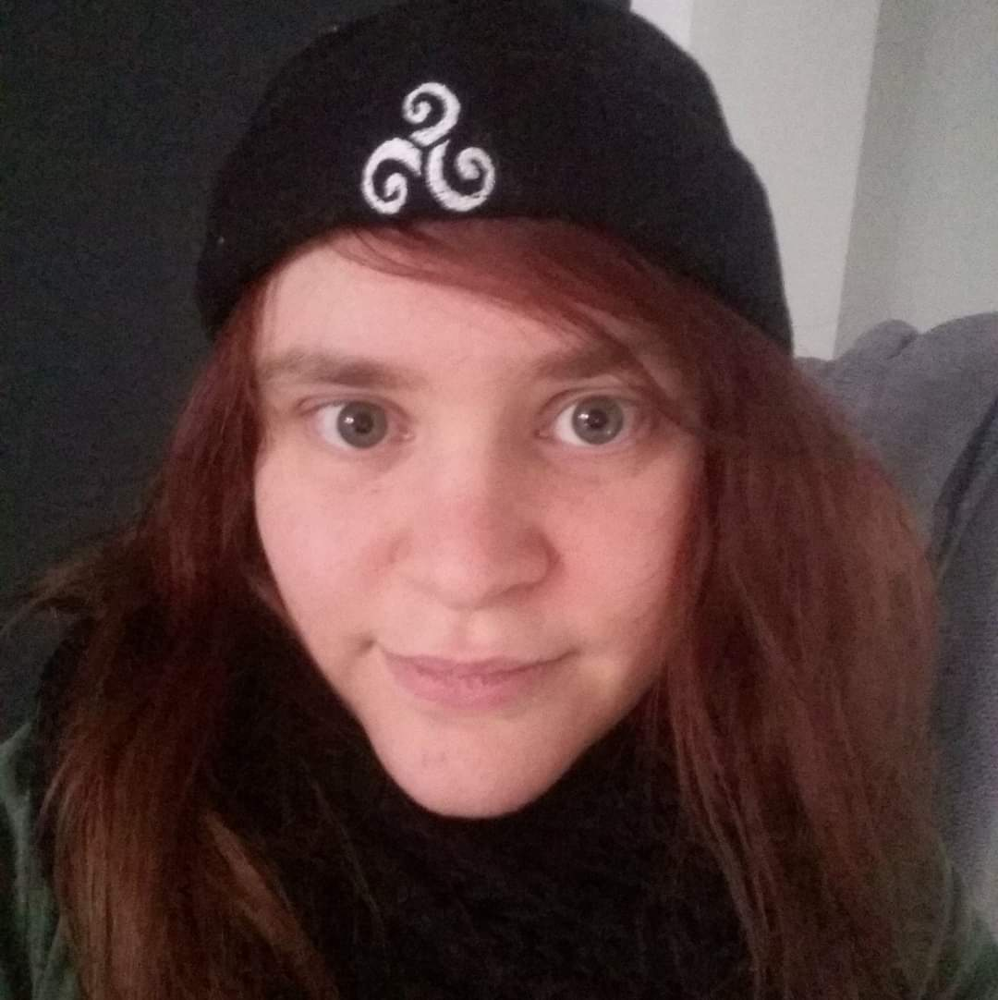

# MELINAND Eva
*"Work hard in silence, let your success be the noise.”* – Frank Ocean

## Just a girl from the literary world who wants to learn and become a web developer.

| | |
------------ | -------------
Birthday | 22/08
Favorite color | red (I think...)
Favorite food | Don't have one. Every food is good (but carrots... i hate cooked carrots)
Pinneapple on pizza | - [x] yes (don't judge me) - [ ] no

## Hobbies

* Watching movies and series
* Reading
    * Thriller
    * SF
    * Fantasy
* Traveling
* Spending time with my family and friends

## You can always count on me when...
I am shy but I take a lot of distance from things and I think a lot, all the time.
I am also a good listener. If you have any problems (professional, private etc...) I will listen.
I love to learn new things.

## A funny story
When we were young, my brother and i always do stupid things. For exemples throwing raw eggs at the dog from upstairs to feed it, painting cherries red to eat them earlier, covering all the mirrors and windows of the house with moisturizer, ...

### TL;DR
I was a rambunctious child but now everything is fine (most of the time).

[<<Previous](https://github.com/Tompouday/markdown-challenge) // Eva Mélinand // [Next>>](https://github.com/irisrenauld/markdown-challenge)